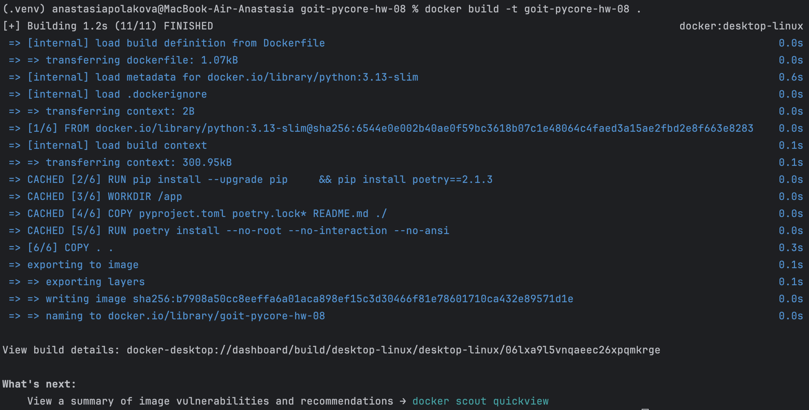
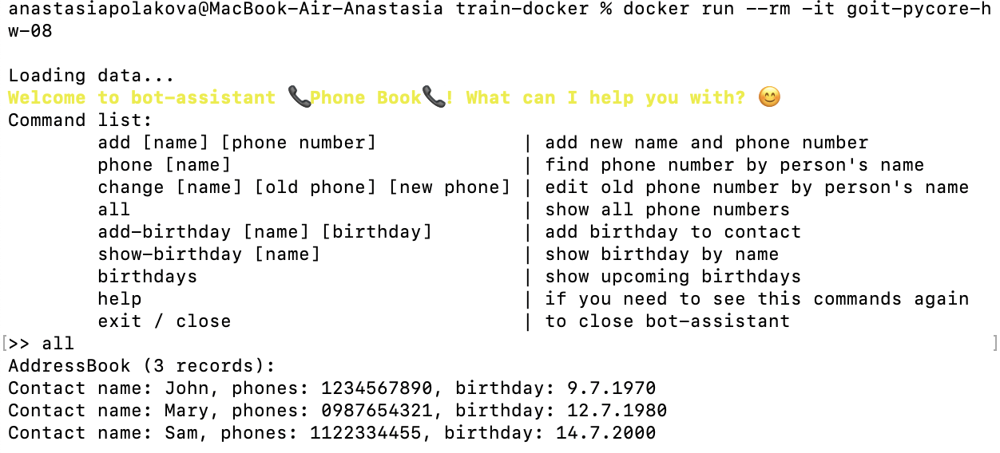

# goit-ds-hw-01

### Завдання 1

Скористайтеся будь-яким зручним інструментом pipenv або poetry, на ваш вибір, для створення віртуального середовища для вашої програми

1. Встановлюємо poetry 
   
   `curl -sSL https://install.python-poetry.org | python3 -`
2. Ініціалізуємо проект goit-pycore-hw-08 
   
   `poetry init`
3. Додаємо залежності (також для розробника)
   
   `poetry add colorama`
   
   `poetry add pylint --dev`
4. Можна активувати середовище 
   
   `poetry shell`

### Завдання 2

Створіть Dockerfile, в якому встановіть домашню роботу "Персональний помічник" та запустіть його як окремий застосунок в окремому контейнері

1. Створюємо докерфайл
2. Створюємо образ 
   
   `docker build -t goit-pycore-hw-08 .`

3. Запускаємо контейнер у терміналі 
   
   `docker run --rm -it goit-pycore-hw-08`
